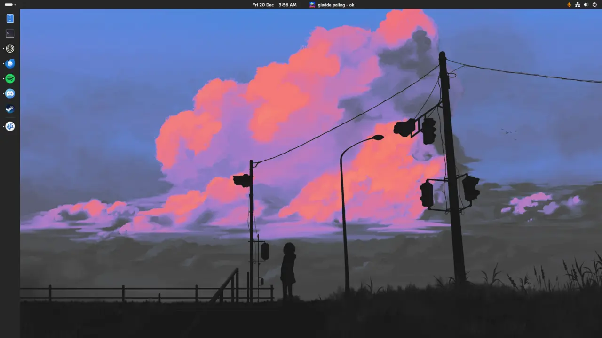

<div>
  
  <div>
    <h3>nixfiles</h3>
      
      <br/>
      
  </div>
</div>

<p></p>

<div align=center>
  
  <p>Screenshot last updated December 20th, 2024</p>
</div>

My dotfiles that I used on my arch-based system can be found [here](https://github.com/skiletro/archfiles), and are a basis for a lot of the configuration here! If you don't use NixOS, you can probably find a more standard config for the thing you are looking for over there.

## Goals 
- **Prioritises Wayland** - *Try and use Wayland components unless absolutely necessary.*
- **Function over Form** - *While appearance is extremely important, function comes first. I try to avoid spending all my time ricing nowadays, so if possible I generally just use a solution made by someone else.*
- **Keep it simple, stupid** - *I'm trying to limit the amount inputs and dependencies that I use, and ensuring that the repo is readable from an outsiders perspective. I'm obviously going to be a bit biased in this as I am the author, but I'm trying my best.*
- **User-facing systems only** - *I've decided to keep server configurations in a different flake, as including them here will only complicate things even further. The only headless system as of writing is the WSL configuration, which I think still counts as user-facing.*

## Installation Guide
Please note that this flake is pretty specialised for my use case, and you would probably be better off just stealing the parts you like and then encorporating that into your own flake. This install guide is here **just for reference** (and because I forget how to do this sometimes).

First, install NixOS onto your target system using a [live USB](https://nixos.org/manual/nixos/stable/#sec-booting-from-usb), setting the username to `jamie`. Once you have done this, run the following commands as the `jamie` user...
```bash
nix-shell -p git neovim alejandra # Required to fetch this config, and to edit it.
git clone https://github.com/skiletro/nixfiles ~/.nix_config && cd ~/.nix_config
mkdir hosts/$your_hostname
cp /etc/nixos/configuration.nix hosts/$your_hostname/default.nix
cp /etc/nixos/hardware-configuration.nix hosts/$your_hostname/
nvim hosts/$your_hostname/default.nix # Change the networking hostname to $your_hostname. You'll probably want to remove any options that may conflict with the common/ options.
nvim flake.nix # Add a new entry for this hostname under `nixosConfigurations`
alejandra . # Makes sure everything is formatted correctly, and catches any obvious errors.
git add . # Stage everything so Nix doesn't freak out
sudo nixos-rebuild boot --flake .#$your_hostname
```
...and reboot!

## Todo
- [ ] Configure GNOME declaratively using dconf (See [the wiki](https://wiki.nixos.org/wiki/GNOME))
- [ ] Expand on AMD GPU module
- [ ] Update Visual Studio Code settings
- [ ] Fix font in Visual Studio Code terminal

## Acknowledgements
- [NotAShelf's Nyx Repo](https://github.com/NotAShelf/nyx) - a huge help (also I stole quite a lot of stuff)
- [linkfrg's dotfiles](https://github.com/linkfrg/dotfiles) - was incredibly useful in writing better eww widgets!
- [isabelrose's dotfiles](https://github.com/isabelroses/dotfiles) - shamelessly stole her justfile

If you can help with any of this stuff, please do a pull request as I am still learning!
